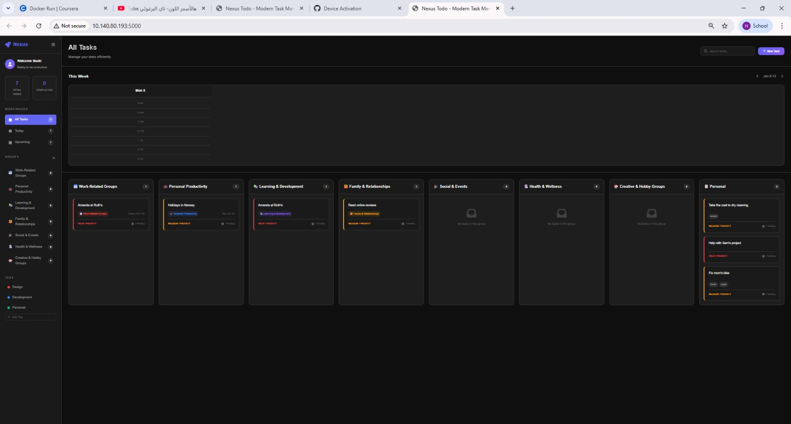

# Todo List App

A simple RESTful API for managing todo tasks built with Flask. Tasks are persisted to a JSON file for data storage.

## Local Installation

1. Install dependencies:

```bash
pip install -r requirements.txt
```

2. Run the application:

```bash
python app.py
```

The server will start on `http://localhost:5000`


## Docker

You can build and run the app inside Docker. There's a `Dockerfile` included for this purpose.

Build the image locally:

```powershell
docker build -t todo-list-app .
```

Run the container locally (maps container port 5000 to host port 5000):

```powershell
docker run -d -p 5000:5000 todo-list-app
```

## Public Docker image

A public image is available on Docker Hub: [mazenbahgat/todo-list-app](https://hub.docker.com/r/mazenbahgat/todo-list-app)

To pull and run it:

```powershell
docker pull mazenbahgat/todo-list-app
docker run -d -p 5000:5000 mazenbahgat/todo-list-app
```

After running any container, visit `http://localhost:5000` in your browser to access the UI.


## Front-end

This project includes a minimal web UI to interact with the API. Files of interest:

- `templates/index.html` — main UI for listing and creating tasks
- `templates/update.html` — UI for editing a task
- `static/script.js` — client-side JavaScript that calls the API (Fetch)
- `static/style.css` — basic styles for the UI

The front-end lets you:

- View all tasks
- Create new tasks
- Mark tasks as done/undone
- Edit task content
- Delete tasks




## Backend 

The backend supports the following features:

- Groups support: tasks can belong to a group. Groups have their own endpoints:
  - **GET** `/groups` — list all groups
  - **POST** `/groups` — create a new group (body: `name`, optional `color` and `icon`)
  - **DELETE** `/groups/<group_id>` — delete a group and any tasks attached to it
- Tasks now include additional fields:
  - `group_id` (string|null) — the ID of the group the task belongs to
  - `due_date` (string|null) — optional due date (YYYY-MM-DD)
  - `time_range` (string|null) — optional time or time window
  - `priority` (string) — task priority (e.g., `low`, `medium`, `high`)
  - `tags` (array) — list of string tags for filtering/categorization
  - `updated_at` (string) — ISO timestamp of last update

These fields are present in responses from the tasks endpoints. Example task object now looks like:

```json
{
  "id": "...",
  "content": "Buy groceries",
  "group_id": null,
  "status": "pending",
  "due_date": "2025-10-24",
  "time_range": "4:00 PM",
  "priority": "high",
  "tags": ["errand"],
  "created_at": "2025-10-19T16:24:34.603147",
  "updated_at": "2025-10-19T16:24:34.603147"
}
```

The app also initializes sample groups and tasks on first run (see `init_sample_data()` in `app.py`). This provides starter data for both groups and tasks so the UI shows meaningful content out-of-the-box.

## API Endpoints

### Groups
1. Get All Groups
**GET** `/groups`

Returns all groups in the system.

**Response:**
```json
{
  "groups": [
    {
      "id": "...",
      "name": "Work-Related Groups",
      "color": "#ef4444",
      "icon": "📅",
      "created_at": "2025-10-19T16:24:34.603147"
    }
  ]
}
```

2. Create Group
**POST** `/groups`

Creates a new group. Request body must include `name`. Optional `color` and `icon` can be provided.

**Request body:**
```json
{ "name": "Personal", "color": "#3b82f6", "icon": "💼" }
```

**Response (201):**
```json
{
  "id": "...",
  "name": "Personal",
  "color": "#3b82f6",
  "icon": "💼",
  "created_at": "2025-10-19T16:24:34.603147"
}
```

3. Delete Group
**DELETE** `/groups/<group_id>`

Deletes a group and any tasks that belong to it.

**Response (200):**
```json
{ "message": "Group deleted successfully" }
```

### 1. Get All Tasks
**GET** `/tasks`

Returns all tasks in the system.

**Response:**
```json
{
  "tasks": [
    {
      "id": "f52eb39f-e450-425a-b524-ae3aadff5cf8",
      "content": "Buy groceries",
      "group_id": null,
      "status": "pending",
      "due_date": null,
      "time_range": null,
      "priority": "medium",
      "tags": [],
      "created_at": "2025-10-19T16:24:34.603147",
      "updated_at": "2025-10-19T16:24:34.603147"
    }
  ]
}
```

### 2. Get Single Task
**GET** `/tasks/<task_id>`

Returns a specific task by its ID.

**Response (200):**
```json
{
  "id": "f52eb39f-e450-425a-b524-ae3aadff5cf8",
  "content": "Buy groceries",
  "group_id": null,
  "status": "pending",
  "due_date": null,
  "time_range": null,
  "priority": "medium",
  "tags": [],
  "created_at": "2025-10-19T16:24:34.603147",
  "updated_at": "2025-10-19T16:24:34.603147"
}
```

**Response (404):**
```json
{
  "error": "Task not found"
}
```

### 3. Create New Task
**POST** `/tasks`

Creates a new task.

**Request Body:**
```json
{
  "content": "Buy groceries",
  "group_id": null,
  "due_date": "2025-10-24",
  "time_range": "4:00 PM",
  "priority": "high",
  "tags": ["errand"]
}
```

**Response (201):**
```json
{
  "id": "f52eb39f-e450-425a-b524-ae3aadff5cf8",
  "content": "Buy groceries",
  "group_id": null,
  "status": "pending",
  "due_date": "2025-10-24",
  "time_range": "4:00 PM",
  "priority": "high",
  "tags": ["errand"],
  "created_at": "2025-10-19T16:24:34.603147",
  "updated_at": "2025-10-19T16:24:34.603147"
}
```

**Response (400):**
```json
{
  "error": "Content is required"
}
```

### 4. Update Task
**PUT** `/tasks/<task_id>`

Updates an existing task's content and/or status.

**Request Body (partial updates allowed):**
```json
{
  "content": "Buy organic groceries",
  "status": "done"
}
```

**Response (200):**
```json
{
  "id": "f52eb39f-e450-425a-b524-ae3aadff5cf8",
  "content": "Buy organic groceries",
  "group_id": null,
  "status": "done",
  "due_date": null,
  "time_range": null,
  "priority": "medium",
  "tags": [],
  "created_at": "2025-10-19T16:24:34.603147",
  "updated_at": "2025-10-20T09:12:01.123456"
}
```

**Response (404):**
```json
{
  "error": "Task not found"
}
```

**Response (400):**
```json
{
  "error": "Status must be either \"pending\" or \"done\""
}
```

### 5. Delete Task
**DELETE** `/tasks/<task_id>`

Deletes a task by its ID.

**Response (200):**
```json
{
  "message": "Task deleted successfully"
}
```

**Response (404):**
```json
{
  "error": "Task not found"
}
```

### 6. Health Check
**GET** `/health`

Returns the health status of the API and current task count.

**Response:**
```json
{
  "status": "healthy",
  "tasks_count": 3
}
```

## Task Model

Each task has the following structure:

| Field | Type | Description |
|-------|------|-------------|
| `id` | string | UUID v4 identifier |
| `content` | string | Task description |
| `group_id` | string|null | ID of the group the task belongs to (nullable) |
| `status` | string | Either "pending" or "done" |
| `due_date` | string|null | Optional due date (YYYY-MM-DD) |
| `time_range` | string|null | Optional time or time window |
| `priority` | string | Task priority (e.g., `low`, `medium`, `high`) |
| `tags` | array | Array of string tags |
| `created_at` | string | ISO timestamp of creation |
| `updated_at` | string | ISO timestamp of last update |

## Example Usage

### Using curl

**Create a task:**
```bash
curl -X POST http://localhost:5000/tasks \
  -H "Content-Type: application/json" \
  -d '{"content": "Learn Flask"}'
```

**Get all tasks:**
```bash
curl http://localhost:5000/tasks
```

**Update a task:**
```bash
curl -X PUT http://localhost:5000/tasks/<task_id> \
  -H "Content-Type: application/json" \
  -d '{"status": "done"}'
```

**Delete a task:**
```bash
curl -X DELETE http://localhost:5000/tasks/<task_id>
```

## Data Storage

Tasks are automatically saved to `data.json` in the application directory. The file is created automatically when the first task is added.
