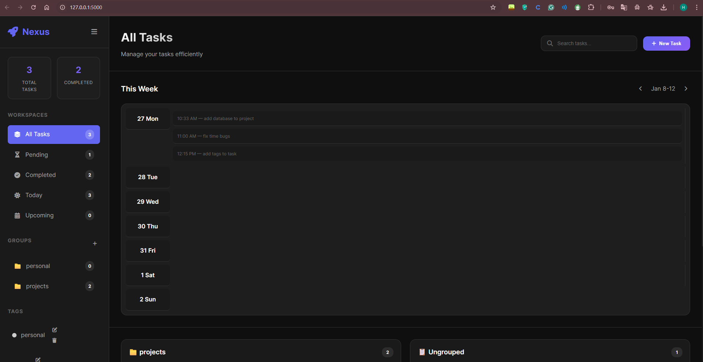
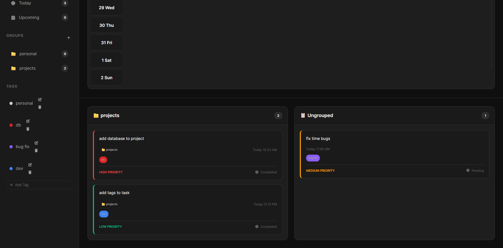
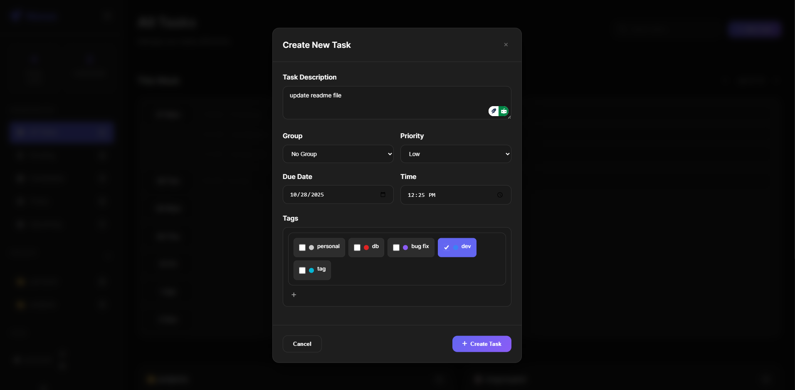
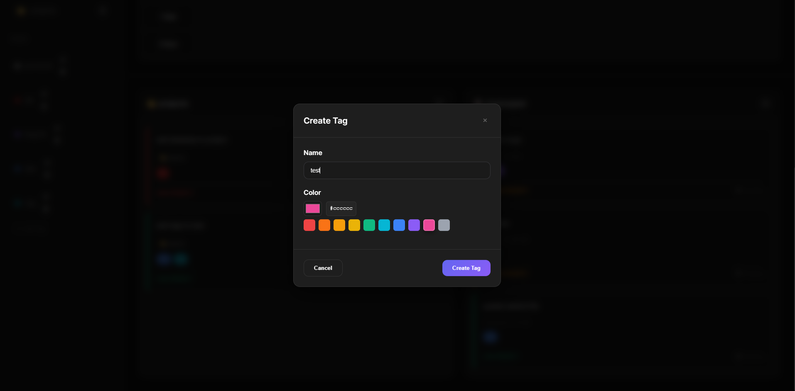
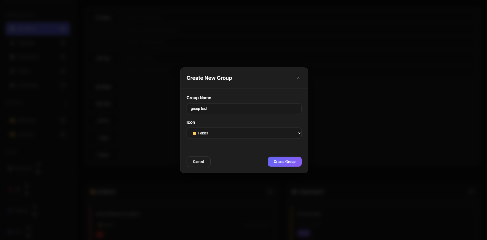

# Dockerized Todo List App

A simple RESTful API for managing todo tasks built with Flask. The app runs either directly with Python or inside Docker. When using Docker Compose the database runs as a separate Postgres service and data is stored on a named Docker volume so it persists across container restarts.

## Local Installation

1. Install dependencies:

```bash
pip install -r requirements.txt
```

2. Run the application:

```bash
python app.py
```

The server will start on `http://localhost:5000`


## Docker / Docker Compose

This repository includes a `docker-compose.yml` that runs two services:

- `db` — Postgres 15 database. The compose file creates a named volume for Postgres data so the database files persist on your machine even if the container is removed.
- `web` — the Flask app built from the included `Dockerfile`.

Key points:

- Database credentials and the connection string are provided via the `DATABASE_URL` environment variable in `docker-compose.yml`.
- The Postgres data is stored in a Docker volume (see `volumes:` in `docker-compose.yml`) — this is what gives you persistence across container restarts.

Quick start (PowerShell):

```powershell
docker-compose up -d
```

Stop containers (volume remains):

```powershell
docker-compose down
```

To inspect the named volume and verify its existence:

```powershell
docker volume ls
docker volume inspect <volume_name>
```

To inspect the DB directly (runs psql inside the `db` container):

```powershell
docker-compose exec db psql -U postgres -d todo -c "SELECT count(*) FROM tasks;"
```

Backup DB before big changes:

```powershell
docker-compose exec db pg_dump -U postgres -d todo > backup.sql
```

### Public Docker image
A public image is available on Docker Hub: [mazenbahgat/todo-list-app](https://hub.docker.com/r/mazenbahgat/todo-list-app)

To pull and run it:

```powershell
docker pull mazenbahgat/todo-list-app
docker run -d -p 5000:5000 mazenbahgat/todo-list-app
```
After running any container, visit http://localhost:5000 in your browser to access the UI.

## API Endpoints

The server exposes these endpoints (all return JSON):

Groups
- GET /groups — list all groups
- POST /groups — create a group (body: { name, color?, icon? })
- DELETE /groups/<group_id> — delete a group (tasks are un-grouped)

Tasks
- GET /tasks — list all tasks
- GET /tasks/<task_id> — get a single task
- POST /tasks — create a task (body: { content, group_id?, due_date?, time_range?, priority?, tags? })
- PUT /tasks/<task_id> — update a task (partial updates allowed)
- DELETE /tasks/<task_id> — delete a task
- GET /tasks/today — tasks due today
- GET /tasks/upcoming — tasks with due_date > today
- GET /tasks/pending — tasks with status pending
- GET /tasks/completed — tasks with status done

Tags
- GET /tags — list tags
- POST /tags — create a tag (body: { name, color? })
- PUT /tags/<tag_id> — update
- DELETE /tags/<tag_id> — delete (removes tag id from tasks)

Counts
- GET /tasks/counts — full counts (total, pending, completed, today, upcoming, per_group)
- GET /tasks/counts/summary — lightweight summary (total, pending, completed)

Health
- GET /health — basic health status (may include task count)

## Data Model (brief)

Each task includes these fields (JSON):

- id (string, uuid)
- content (string)
- group_id (string|null)
- status ("pending" | "done")
- due_date (YYYY-MM-DD|null)
- time_range (string|null)
- priority (string)
- tags (array of tag objects)
- created_at, updated_at (ISO timestamps)

## Persistence

- The database service in `docker-compose.yml` uses a named Docker volume to persist Postgres data. That volume survives `docker-compose down` (unless you explicitly remove it).
- To confirm persistence: create data (via the UI or API), run `docker-compose down`, then `docker-compose up -d` and verify the same rows are present in the DB.

## Notes

- The app is designed to be lightweight and suitable for local development. For production use you'd want to add authentication, migrations with Alembic, and backup/restore procedures for the DB.

## Demo






